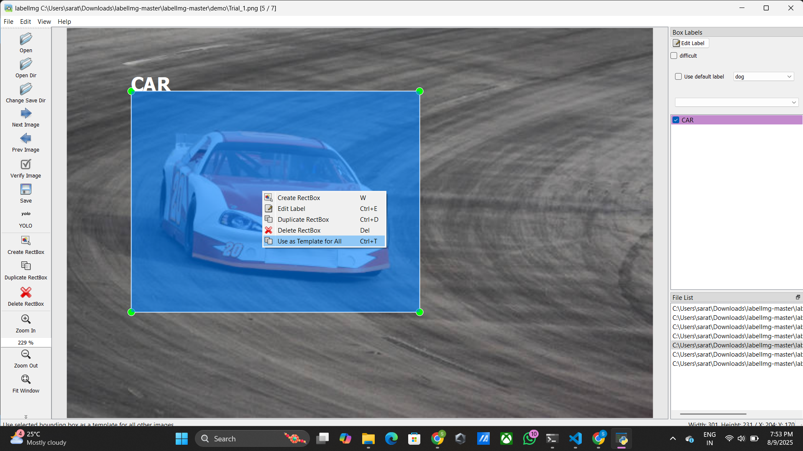
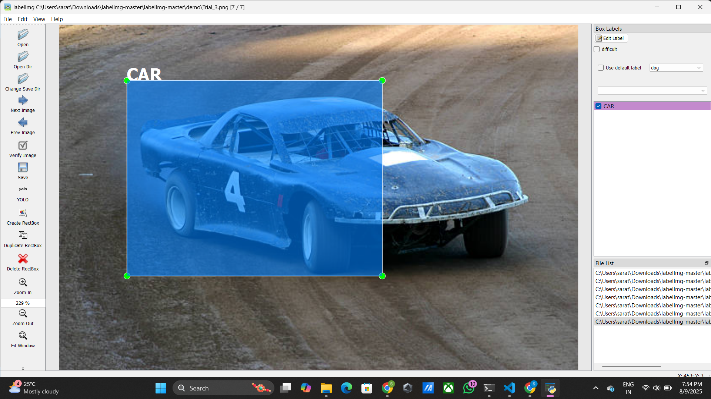
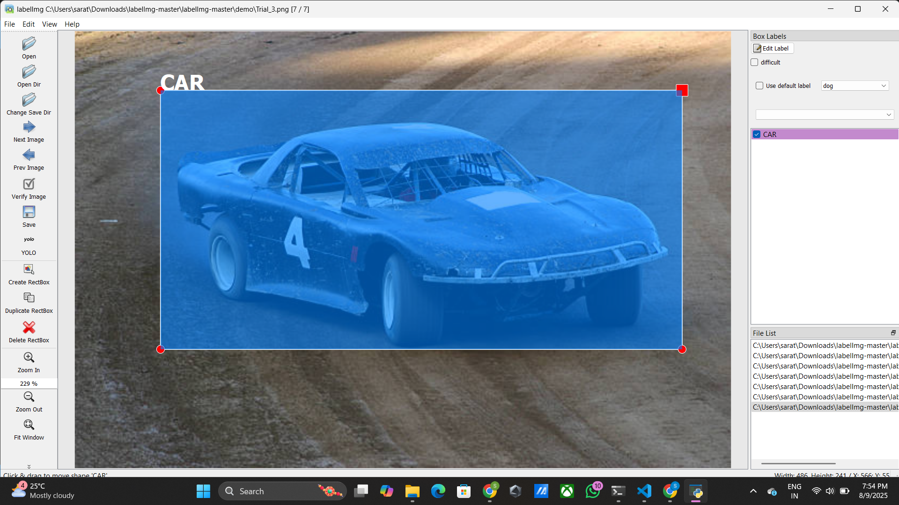

<div align="center">

# 🖼️ Improved LabelImg – With Template Feature

</div>

<p align="center">
  <b>Fast • Stable • Cross-Platform • Open Source</b><br>
  ✨ Enhanced version of <a href="https://github.com/tzutalin/labelImg">LabelImg</a> with bug fixes & new features ✨
</p>

<p align="center">
  <a href="https://github.com/SARATH062005/labelImg/stargazers"></a>
  <a href="https://github.com/SARATH062005/labelImg/network/members"></a>
  <a href="https://github.com/SARATH062005/labelImg/issues"></a>
  <a href="https://github.com/SARATH062005/labelImg/blob/main/LICENSE"></a>
</p>

---

## 📖 Overview
This is a **custom enhanced version of LabelImg** — an open-source graphical image annotation tool — with **major bug fixes** and **full compatibility on Windows, Linux, and macOS**.  
We’ve also introduced a **Template RectBox Feature** allowing you to **apply the same bounding box to all images in a directory** for faster annotation.  

I have actively contributed to this open-source project by **fixing critical issues in the Windows application** and **improving existing features**, making the tool more **stable**, **user-friendly**, and **efficient** across platforms.

---

## 📌 Credits
This project is originally based on [LabelImg](https://github.com/tzutalin/labelImg) by:  

- **Tzutalin** (2015–Present)  
- **Bryan Russell, Antonio Torralba, William T. Freeman** (MIT CSAIL, 2013)  

Enhanced, maintained, and improved by **Sarath Chandiran** in 2025.

---

## ✨ New Features Added
- 🆕 **Template RectBox** – Save a bounding box template and apply it to all images in the directory.  
- 🎯 **Hotkeys for Templates**  
  - **Ctrl+T** → Apply Template  
  - **Ctrl+Shift+T** → Unselect Template  
- 🛠 **Fixed all known LabelImg bugs** (stable on Windows, Linux, macOS)  
- 📦 **Better Windows Compatibility** – No more crashes or PyQt5 resource issues.  

---

## 📷 Example

<div align="center">
  <table>
    <tr>
      <td align="center">
        <br>
        <em>Figure 1: Draw your Bounding Box and Add Your Label</em>
      </td>
    </tr>
    <tr><td><br></td></tr>
    <tr>
      <td align="center">
        <br>
        <em>Figure 2: Right Click on the bounded box and click 'Use Template for all'</em>
      </td>
    </tr>
    <tr><td><br></td></tr>
    <tr>
      <td align="center">
        <br>
        <em>Figure 3: Click Next Image, The Template RectBox will be applied.</em>
      </td>
    </tr>
    <tr><td><br></td></tr>
    <tr>
      <td align="center">
        <br>
        <em>Figure 4: You can adjust based on your needs</em>
      </td>
    </tr>
  </table>
</div>

---

## 🖥️ How to Clone This Repo
```bash
# Clone the repository
git clone https://github.com/SARATH062005/labelimg.git

# Navigate into the project folder
cd labelimg
````

---

## 🛠 Installation

### Linux

```bash
sudo apt-get install pyqt5-dev-tools
sudo pip3 install -r requirements/requirements-linux-python3.txt
make qt5py3
python3 labelImg.py
python3 labelImg.py [IMAGE_PATH] [PRE-DEFINED CLASS FILE]
```

### macOS

```bash
# Install dependencies via Homebrew
brew install qt       # Installs qt-5.x.x
brew install libxml2

# OR using pip
pip3 install pyqt5 lxml

# Build and run
make qt5py3
python3 labelImg.py
python3 labelImg.py [IMAGE_PATH] [PRE-DEFINED CLASS FILE]
```

### Windows

#### Standard Python

```bash
# Open cmd and go to the LabelImg directory
pyrcc4 -o libs/resources.py resources.qrc
# For PyQt5
pyrcc5 -o libs/resources.py resources.qrc

python labelImg.py
python labelImg.py [IMAGE_PATH] [PRE-DEFINED CLASS FILE]
```

#### Using Anaconda

```bash
# Open Anaconda Prompt and go to the LabelImg directory
conda install pyqt=5
conda install -c anaconda lxml
pyrcc5 -o libs/resources.py resources.qrc
python labelImg.py
python labelImg.py [IMAGE_PATH] [PRE-DEFINED CLASS FILE]
```

---

## 🎹 Hotkeys

| Key              | Action                 |
| ---------------- | ---------------------- |
| Ctrl + S         | Save                   |
| Ctrl + T         | Apply Template RectBox |
| Ctrl + Shift + T | Unselect Template      |
| W                | Create a RectBox       |
| D                | Next Image             |
| A                | Previous Image         |
| Delete           | Delete Selected Shape  |
| Ctrl + Z         | Undo                   |
| Ctrl + Shift + Z | Redo                   |
| Space            | Verify Image           |

---

## 📜 License

```
MIT License  

Copyright (c) 2025 Sarath Chandiran  
Modifications and maintenance by Sarath Chandiran  

Based on LabelImg by Tzutalin, Bryan Russell, Antonio Torralba, William T. Freeman  

Permission is hereby granted, free of charge, to any person obtaining a copy...
```

---

## 🤝 Contributing

We welcome contributions!

1. Fork the project 🍴
2. Create your feature branch 🌱
3. Commit your changes 💡
4. Push to your branch 🚀
5. Open a Pull Request 🎯

---

## 📬 Contact

* **Author:** Sarath Chandiran
* **Email:** [sarathchandiran4@gmail.com](mailto:sarathchandiran4@gmail.com)
* **GitHub:** [@SARATH062005](https://github.com/SARATH062005/)

<p align="center">⭐ If you find this useful, please give it a star on GitHub! ⭐</p>

